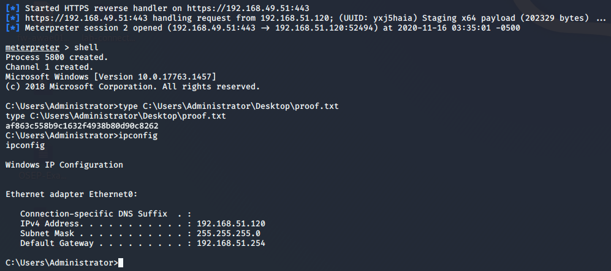

# The OSCP Playbook

This repository contains various cheatsheets and references to useful commands and tools for the PEN-200 exam, updated to version 2023. 
___

### Exam Structure

A total of 6 machines.

* 3 Independent Machines
    * 10 pts - User Flag
    * 10 pts - Root Flag
* 1 Active Directory Set
    * 2 Client & 1 Domain Controller
    * 40 pts - Domain Compromission

*23 hours and 45 minutes to complete the exam.*

**In order to pass the exam 70 pts out of 100 pts must be scored.**

___

### Screenshot Requirements

Each local.txt/proof.txt must be shown in a screenshot of the interactive shell obtained that includes:

* content of the txt file
* `ipconfig` output (`ip addr` for linux)
* `whoami` output

Screenshot Sample:

___

### Submission Checklist

- [x] Exam Report in PDF Format
- [x] PDF file name "OSCP-OS-XXXXX-Exam-Report.pdf", where "OS-XXXXX" is your OSID
- [x] PDF archived into a .7z file
- [x] The format for the .7z file name is "OSCP-OS-XXXXX-Exam-Report.7z", where "OS-XXXXX" is your OSID
- [x] Make sure that your archive is not more than 200MB
- [x] Upload your .7z file to https://upload.offsec.com 

___

##### [1] https://help.offsec.com/hc/en-us/articles/360040165632-OSCP-Exam-Guide